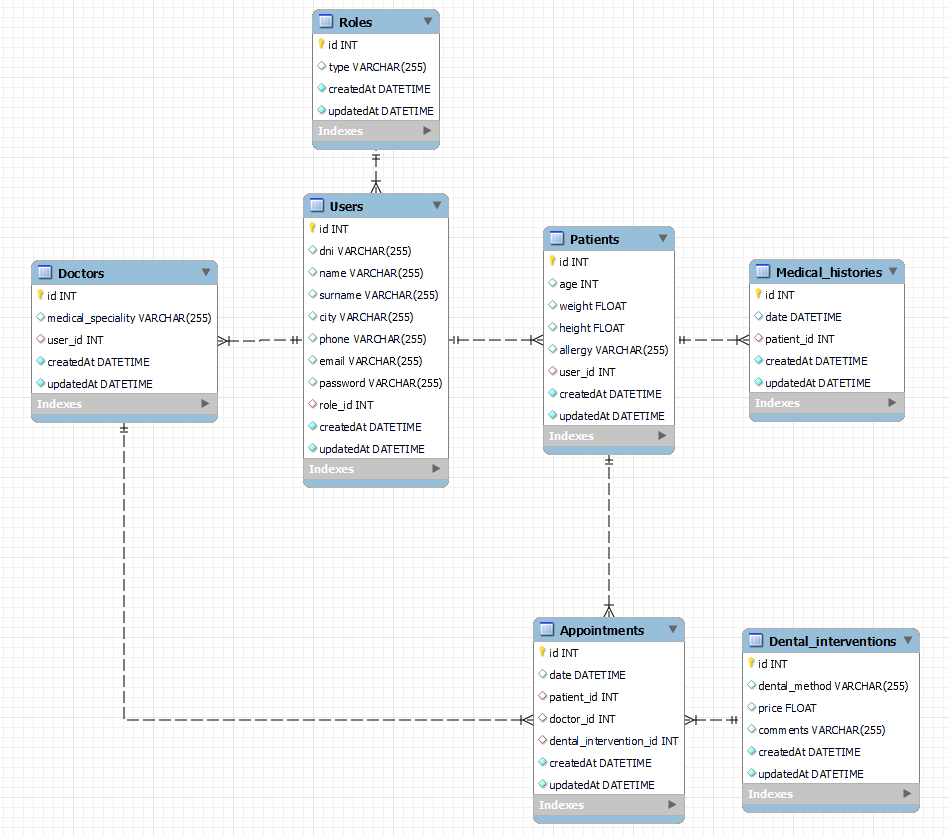

<h1 align="center"> Clinica-TrueSmile </h1>

<details>
  <summary>Contenido 📝</summary>
  <ol>
    <li><a href="#objetivo">Objetivo</a></li>
    <li><a href="#sobre-el-proyecto">Sobre el proyecto</a></li>
    <li><a href="#deploy">Deploy</a></li>
    <li><a href="#stack">Stack</a></li>
    <li><a href="#diagrama-bd">Diagrama</a></li>
    <li><a href="#instalación-en-local">Instalación</a></li>
    <li><a href="#endpoints">Endpoints</a></li>
    <li><a href="#futuras-funcionalidades">Futuras funcionalidades</a></li>
    <li><a href="#contribuciones">Contribuciones</a></li>
    <li><a href="#licencia">Licencia</a></li>
    <li><a href="#webgrafia">Webgrafia</a></li>
    <li><a href="#desarrollo">Colaboradores</a></li>
    <li><a href="#agradecimientos">Agradecimientos</a></li>
    <li><a href="#contacto">Contacto</a></li>
  </ol>
</details>

## Objetivo :dart:
Este proyecto requería crear un backend correspondiente al sistema de gestión de citas para una clínica dental. En este caso llamada TrueSmile.


## Sobre el proyecto :file_folder:
Esta aplicación está pensada para ayudar a gestionar las citas entre pacientes y doctores de una clínica. 
En ella, todos los usuarios podrán registrarse, hacer login, acceder a su perfil y modificar sus datos de perfil. 
Además, los pacientes podrán ver sus citas, crearlas, modificarlas y anularlas. 
Los doctores tendrán acceso a ver los pacientes registrados así como a las citas existentes y a las suyas propias.

## Deploy 🚀
<div align="center">
    <a href="https://github.com/rgolfe81/Clinica-TrueSmile.git">🚀<strong>Clínica TrueSmile </strong></a>🚀
</div>

## Stack :paperclip:
Tecnologías utilizadas:
<div>
<a href="https://sequelize.org//">
    
</a>
<a href="https://www.expressjs.com/">
    
</a>
<a href="https://nodejs.org/es/">
    
</a>
<a href="https://developer.mozilla.org/es/docs/Web/JavaScript" width="100">
    
</a>
 </div>


## Diagrama BD :chart_with_upwards_trend:


## Instalación en local :electric_plug:
1. Clonar el repositorio
2. Instalar dependencia y librerias
```
    ` $ npm i express nodemon dotenv mysql2 sequelize sequelize-cli bcrypt jsonwebtoken `
```
3. Conectar el repositorio con la base de datos 
```
    `$ npm sequelize-cli db:create`
```
4.  Ejecutar las migraciones
```
    `$ npx sequelize-cli db: migrate`
```
5.  Ejecutar los seeders 
```
    `$ npx sequelize db:seed:all`
```
6.  Levantar el servidor
```
    `$ npm run dev` 
```

## Endpoints :pushpin:
<details>
<summary>Endpoints</summary>

- AUTH
    - REGISTER

            POST hlocalhost:3000/auth/register
        body:
        ``` js
            {
                "user": "Vicent",
                "email": "vicent@vicent.com",
                "password": "000000"
            }
        ```

    - LOGIN

            POST localhost:3000/auth/login
        body:
        ``` js
            {
                "user": "Vicent",
                "email": "vicent@vicent.com",
                "password": "000000"
            }
        ```

- USER 

    - VER MI PERFIL  
            GET localhost:3000/user/profile/:id

    - MODIFICAR MI PERFIL  
            PUT localhost:3000/user/users/:id
        body:
        ``` js
            {
            "name": "Vicent",
            "surname": "Pedreguer",
            "city": "València",
            "phone": "66666666",
            "email": "vicent@vicent.com",
            }
        ``` 

- APPOINTMENT

    - CREAR CITAS  
            POST localhost:3000/appointment/create
        body:
        ``` js
            {
            "date": "2023-03-06 12:00:00",
            "doctor_id": 1,
            "patient_id": 3,
            }
        ``` 

    - MODIFICAR CITAS  
            PUT localhost:3000/appointment/update
        body:
        ``` js
            {
            "date": "2023-03-20 14:00:00",
            "doctor_id": 1,
            }
        ``` 
    - VER CITAS COMO PACIENTE
            GET localhost:3000/appointment/viewPatient

    - VER CITAS COMO DOCTOR
            GET localhost:3000/appointment/viewDoctor

    - VER TODAS LAS CITAS
            GET localhost:3000/appointment/

- DOCTOR

    - VER PACIENTES REGISTRADOS
            GET localhost:3000/doctor/all-patients

</details>

## Futuras funcionalidades :pencil:
[ ] Añadir tipos de intervención 
[ ] Añadir historial médico  

## Contribuciones :mailbox:
Las sugerencias y aportaciones son siempre bienvenidas.  

Puedes hacerlo de dos maneras:

1. Abriendo una issue
2. Crea un fork del repositorio
    - Crea una nueva rama  
        ```
        $ git checkout -b feature/nombreUsuario-mejora
        ```
    - Haz un commit con tus cambios 
        ```
        $ git commit -m 'feat: mejora X cosa'
        ```
    - Haz push a la rama 
        ```
        $ git push origin feature/nombreUsuario-mejora
        ```
    - Abre una solicitud de Pull Request

## Licencia :scroll:
Este proyecto se encuentra bajo licencia de MIT License

## Webgrafia :books:
Para conseguir mi objetivo he recopilado información de:
- <a href="https://sequelize.org"></a>
- <a href="https://stackoverflow.com"></a>

## Colaboradores :raising_hand:

https://github.com/PaulaRibelles

## Agradecimientos :sparkles:

- A los profesores y compañeros de Geekshubs por encontrar siempre un minuto para ayudarnos. 

- A nuestras respectivas parejas por entender que le dediquemos las 24 horas del día al proyecto y por no dejar que nuestra taza de café se vacíe.

## Contacto :email:

· Rubén Golfe: rgolfe81@gmail.com

· Paula Ribelles: ribelles.camacho@gmail.com
